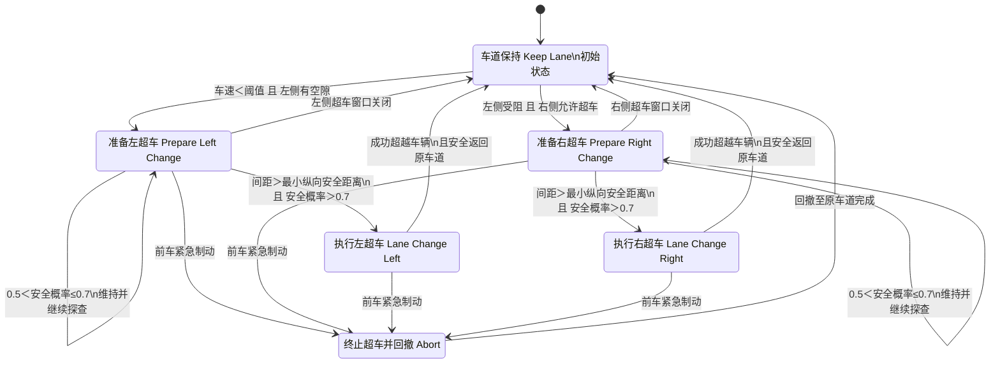

```mermaid
stateDiagram-v2
    [*] --> KL
    KL : 车道保持 Keep Lane\n初始状态

    %% KL 转向准备超车
    KL --> PLC_L : 车速＜阈值 且 左侧有空隙
    KL --> PLC_R : 左侧受阻 且 右侧允许超车

    PLC_L : 准备左超车 Prepare Left Change
    PLC_R : 准备右超车 Prepare Right Change

    %% 准备超车窗口关闭，返回KL
    PLC_L --> KL : 左侧超车窗口关闭
    PLC_R --> KL : 右侧超车窗口关闭

    %% 安全概率中等，保持探查
    PLC_L --> PLC_L : 0.5＜安全概率≤0.7\n维持并继续探查
    PLC_R --> PLC_R : 0.5＜安全概率≤0.7\n维持并继续探查

    %% 满足条件，执行超车
    PLC_L --> LCL : 间距＞最小纵向安全距离\n且 安全概率＞0.7
    PLC_R --> LCR : 间距＞最小纵向安全距离\n且 安全概率＞0.7

    LCL : 执行左超车 Lane Change Left
    LCR : 执行右超车 Lane Change Right

    %% 核心完善点：成功超越并安全返回 → 回到KL
    LCL --> KL : 成功超越车辆\n且安全返回原车道
    LCR --> KL : 成功超越车辆\n且安全返回原车道

    %% 任何超车相关状态，前车急刹 → 终止超车
    PLC_L --> ABORT : 前车紧急制动
    PLC_R --> ABORT : 前车紧急制动
    LCL --> ABORT : 前车紧急制动
    LCR --> ABORT : 前车紧急制动

    ABORT : 终止超车并回撤 Abort
    ABORT --> KL : 回撤至原车道完成
```

