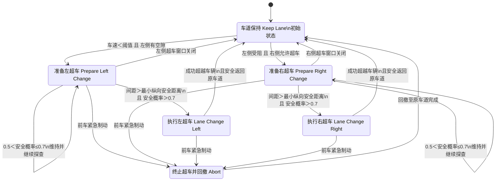
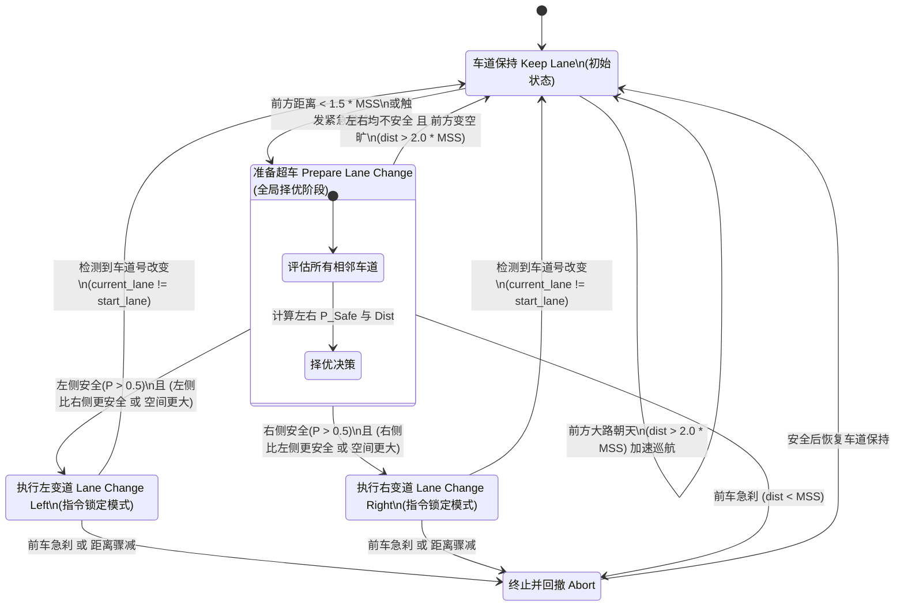

```mermaid
stateDiagram-v2
    [*] --> KL
    KL : 车道保持 Keep Lane\n初始状态

    %% KL 转向准备超车
    KL --> PLC_L : 车速＜阈值 且 左侧有空隙
    KL --> PLC_R : 左侧受阻 且 右侧允许超车

    PLC_L : 准备左超车 Prepare Left Change
    PLC_R : 准备右超车 Prepare Right Change

    %% 准备超车窗口关闭，返回KL
    PLC_L --> KL : 左侧超车窗口关闭
    PLC_R --> KL : 右侧超车窗口关闭

    %% 安全概率中等，保持探查
    PLC_L --> PLC_L : 0.5＜安全概率≤0.7\n维持并继续探查
    PLC_R --> PLC_R : 0.5＜安全概率≤0.7\n维持并继续探查

    %% 满足条件，执行超车
    PLC_L --> LCL : 间距＞最小纵向安全距离\n且 安全概率＞0.7
    PLC_R --> LCR : 间距＞最小纵向安全距离\n且 安全概率＞0.7

    LCL : 执行左超车 Lane Change Left
    LCR : 执行右超车 Lane Change Right

    %% 核心完善点：成功超越并安全返回 → 回到KL
    LCL --> KL : 成功超越车辆\n且安全返回原车道
    LCR --> KL : 成功超越车辆\n且安全返回原车道

    %% 任何超车相关状态，前车急刹 → 终止超车
    PLC_L --> ABORT : 前车紧急制动
    PLC_R --> ABORT : 前车紧急制动
    LCL --> ABORT : 前车紧急制动
    LCR --> ABORT : 前车紧急制动

    ABORT : 终止超车并回撤 Abort
    ABORT --> KL : 回撤至原车道完成
```

```mermaid
stateDiagram-v2
    [*] --> KL
    KL : 车道保持 Keep Lane\n(初始状态)

    %% KL 转向 PLC
    KL --> PLC : 前方距离 < 1.5 * MSS\n或触发紧急避险
    KL --> KL : 前方大路朝天\n(dist > 2.0 * MSS) 加速巡航

    state PLC {
        direction TB
        [*] --> 评估所有相邻车道
        评估所有相邻车道 --> 择优决策 : 计算左右 P_Safe 与 Dist
    }
    
    PLC : 准备超车 Prepare Lane Change\n(全局择优阶段)

    %% 准备超车状态下的转移
    PLC --> KL : 左右均不安全 且 前方变空旷\n(dist > 2.0 * MSS)
    
    %% 执行变道：增加择优权重逻辑
    PLC --> LCL : 左侧安全(P > 0.5)\n且 (左侧比右侧更安全 或 空间更大)
    PLC --> LCR : 右侧安全(P > 0.5)\n且 (右侧比左侧更安全 或 空间更大)

    LCL : 执行左变道 Lane Change Left\n(指令锁定模式)
    LCR : 执行右变道 Lane Change Right\n(指令锁定模式)

    %% 变道完成判定：只要跨线即回到 KL
    LCL --> KL : 检测到车道号改变\n(current_lane != start_lane)
    LCR --> KL : 检测到车道号改变\n(current_lane != start_lane)

    %% 终止逻辑
    LCL --> ABORT : 前车急刹 或 距离骤减
    LCR --> ABORT : 前车急刹 或 距离骤减
    PLC --> ABORT : 前车急刹 (dist < MSS)
    
    ABORT : 终止并回撤 Abort
    ABORT --> KL : 安全后恢复车道保持
```

